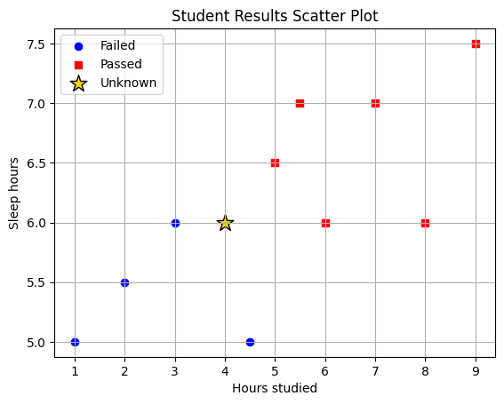
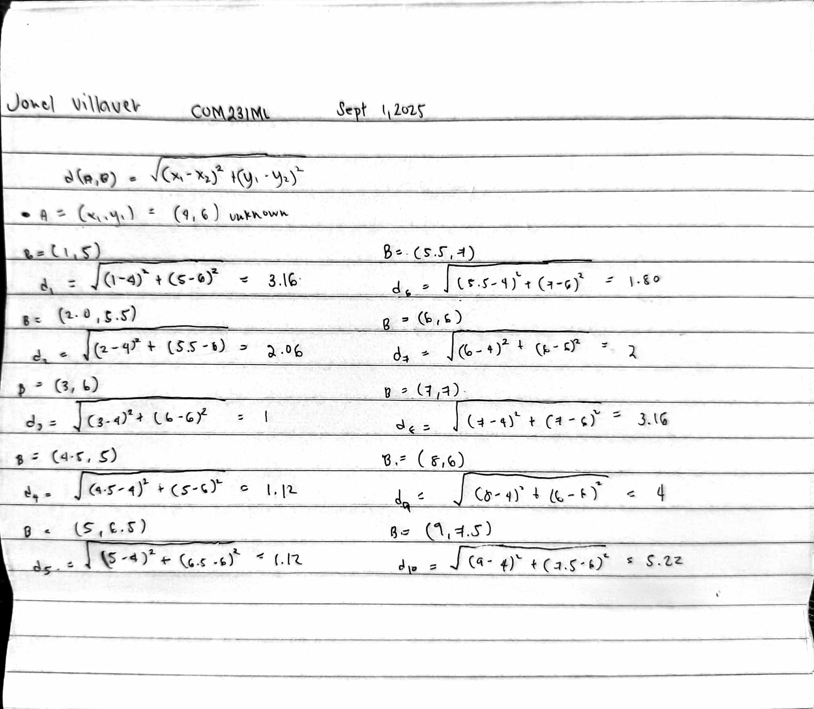

# Assignment 1

Using k-Nearest Neighbours, predict if a student will **Pass (1)** or **Fail (0)** based on:

- $X_1$ = Hours Studied
- $X_2$ = Sleep Hours

---

## Training Data (10 Students)

| Student | Hours Studied $X_1$ | Sleep Hours $X_2$ | Pass/Fail (Y) |
| ------- | ------------------- | ----------------- | ------------- |
| 1       | 1.0                 | 5.0               | 0 (Fail)      |
| 2       | 2.0                 | 5.5               | 0 (Fail)      |
| 3       | 3.0                 | 6.0               | 0 (Fail)      |
| 4       | 4.5                 | 5.0               | 0 (Fail)      |
| 5       | 5.0                 | 6.5               | 1 (Pass)      |
| 6       | 5.5                 | 7.0               | 1 (Pass)      |
| 7       | 6.0                 | 6.0               | 1 (Pass)      |
| 8       | 7.0                 | 7.0               | 1 (Pass)      |
| 9       | 8.0                 | 6.0               | 1 (Pass)      |
| 10      | 9.0                 | 7.5               | 1 (Pass)      |

---

## Task

A new student studied **4 hours** and slept **6 hours**.  
We want to predict whether they **Pass** or **Fail** using **KNN with k = 3**.

---

## 1. Plot all data points using a scatter plot (10 points)

- Use a circle 🔵 for students who failed.
- Use a square 🟥 for students who passed.
- Use a star ⭐ for the unknown data point.

---

## 2. Compute Distances (10 points)

**Note:** Please show all solutions

For the new student, compute the **Euclidean distance** from all data points:

$$
d = \sqrt{(X_1 - 4)^2 + (X_2 - 6)^2}
$$

Fill in the table below:

| Student | Hours Studied (X1) | Sleep Hours (X2) | Pass/Fail (Y) | Euclidean Distance |
| ------- | ------------------ | ---------------- | ------------- | ------------------ |
| 1       | 1.0                | 5.0              | 0             | 3.16               |
| 2       | 2.0                | 5.5              | 0             | 2.06               |
| 3       | 3.0                | 6.0              | 0             | 1                  |
| 4       | 4.5                | 5.0              | 0             | 1.12               |
| 5       | 5.0                | 6.5              | 1             | 1.12               |
| 6       | 5.5                | 7.0              | 1             | 1.80               |
| 7       | 6.0                | 6.0              | 1             | 2                  |
| 8       | 7.0                | 7.0              | 1             | 3.16               |
| 9       | 8.0                | 6.0              | 1             | 4                  |
| 10      | 9.0                | 7.5              | 1             | 5.2                |

---

## 2. Find the 3 Nearest Neighbors (3 points)

- Highlight the rows with the **3 smallest distances**.

| Student | Hours Studied (X1) | Sleep Hours (X2) | Pass/Fail (Y) | Euclidean Distance |
| ------- | ------------------ | ---------------- | ------------- | ------------------ |
| 1       | 1.0                | 5.0              | 0             | 3.16               |
| 2       | 2.0                | 5.5              | 0             | 2.06               |
| **_3_** | **_3.0_**          | **_6.0_**        | **_0_**       | **_1_**            |
| **_4_** | **_4.5_**          | **_5.0_**        | **_0_**       | **_1.12_**         |
| **_5_** | **_5.0_**          | **_6.5_**        | **_1_**       | **_1.12_**         |
| 6       | 5.5                | 7.0              | 1             | 1.80               |
| 7       | 6.0                | 6.0              | 1             | 2                  |
| 8       | 7.0                | 7.0              | 1             | 3.16               |
| 9       | 8.0                | 6.0              | 1             | 4                  |
| 10      | 9.0                | 7.5              | 1             | 5.2                |

---

## 3. Majority Vote (2 points)

- Count how many are **Pass (1)** and how many are **Fail (0)**.
- Predict the outcome for the new student.

| Student | Hours Studied (X1) | Sleep Hours (X2) | Pass/Fail (Y) | Euclidean Distance |
| ------- | ------------------ | ---------------- | ------------- | ------------------ |
| 1       | 1.0                | 5.0              | 0             | 3.16               |
| 2       | 2.0                | 5.5              | 0             | 2.06               |
| 3       | 3.0                | 6.0              | 0             | 1                  |
| 4       | 4.5                | 5.0              | 0             | 1.12               |
| 5       | 5.0                | 6.5              | 1             | 1.12               |
| 6       | 5.5                | 7.0              | 1             | 1.80               |
| 7       | 6.0                | 6.0              | 1             | 2                  |
| 8       | 7.0                | 7.0              | 1             | 3.16               |
| 9       | 8.0                | 6.0              | 1             | 4                  |
| 10      | 9.0                | 7.5              | 1             | 5.2                |

**Nearest 3 neighbors (k=3):**
- (3,6) → Fail (0)
- (4.5,5) → Fail (0)
- (5,6.5) → Pass (1)

**Prediction:** A new student who studied 4 hours and slept 6 hours will **_Fail_** the exam.

## 4. Discussion Questions (5 points)

1. What was your final prediction?

- Using the three nearest neighbors to the new student
  (4,6), the labels are Fail, Fail, Pass (from points (3,6) F, (4.5,5) F, (5,6.5) P). Majority = Fail → the new student is predicted to fail.

2. How would the prediction change if we used **k = 5** instead of **k = 3**?

- The five nearest neighbors are Fail, Fail, Pass, Pass, Pass, which gives 3 Pass vs 2 Fail. Majority = Pass → the new student is predicted to pass when k=5

---
